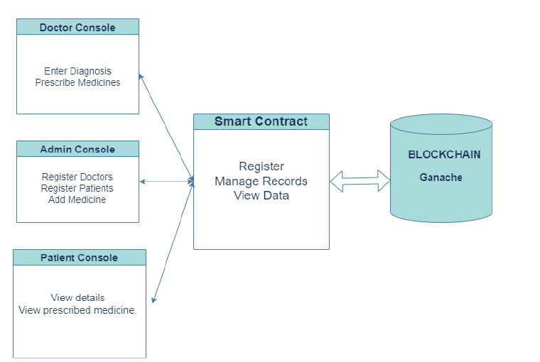
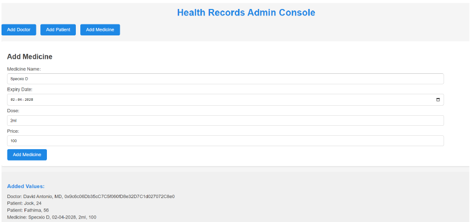
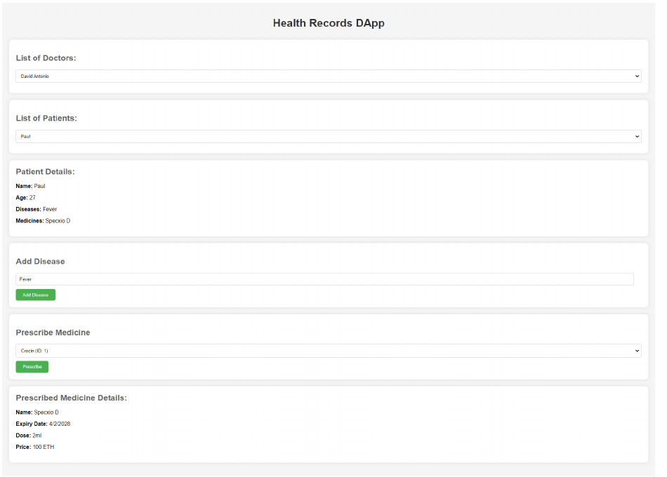
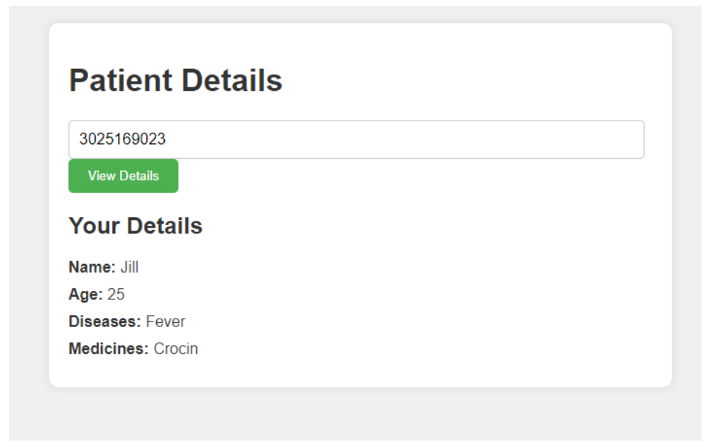

# Health Record

A blockchain-based health records system built on Ethereum. A Solidity smart contract stores doctors, patients, medicines, and prescriptions, with three static web front ends (admin, doctor, patient) that talk to the contract via web3.js.

## Motivation

Centralized electronic health record (EHR) systems are vulnerable to security breaches, unauthorized data manipulation, and give patients little control over who can see their records. This project explores blockchain as an alternative: records written to the chain are tamper-proof and auditable, the system is decentralized instead of relying on one authority, and patients/doctors interact through a smart contract with clearly defined roles instead of an opaque central database.

**Objectives:**

- Design and implement a secure system for managing health records using Ethereum and smart contracts.
- Support user registration, data management, and prescription management.
- Use blockchain immutability to guarantee data integrity and prevent unauthorized alteration.
- Give patients visibility into their own records.
- Evaluate the system's security and performance through testing.

## Architecture

Three roles interact with a single smart contract, which is the only thing that reads or writes the underlying blockchain (Ganache locally, or an Ethereum network in general):



- **Admin console** — registers doctors, registers patients, and adds medicines to the catalog.
- **Doctor console** — enters a diagnosis for a patient and prescribes medicines.
- **Patient console** — looks up a patient's own details and prescribed medicines by UUID.
- **Smart contract** — the only component with write access to the chain; it registers entities, manages records, and serves reads back to whichever console asked.

## Structure

- `src/contract.sol` — the `HealthRecords` smart contract: registers doctors and patients, records diseases, manages a medicine catalog, and links prescriptions to patients.
- `src/app.js` — shared front-end logic. Loads the contract ABI, connects to a local blockchain via web3.js, and drives all three web pages.
- `webapps/admin.html` — admin console for registering doctors, patients, and medicines.
- `webapps/doctor.html` — doctor view for selecting a patient, adding diagnoses, and prescribing medicine.
- `webapps/patient.html` — patient view for looking up your own record and prescriptions by UUID.
- `css/` — stylesheets for each page (`admin.css`, `doctor.css`, `patient.css`).
- `configurations/contractABI.json` — the deployed contract's ABI, fetched at runtime by `app.js`.

## Contract overview

`HealthRecords` (`src/contract.sol`) tracks:

- **Doctors** — name, qualification, and workplace address; only the contract owner (admin) can register a doctor.
- **Patients** — name, age, diseases, and a UUID.
- **Medicines** — name, expiry date, dose, and price.
- **Prescriptions** — medicine IDs linked to a patient's UUID; only registered doctors can prescribe.

Access control is enforced with two modifiers: `onlyAdmin` gates doctor and medicine registration to the contract's deployer, and `onlyDoctors` gates prescribing to addresses that have been registered as a doctor. Every state-changing action (`DoctorRegistered`, `PatientRegistered`, `DiseaseAdded`, `MedicineAdded`, `MedicinePrescribed`) emits an event, so the full history of who registered, diagnosed, or prescribed what is auditable directly from the chain.

## Screenshots

**Admin console** — register doctors and patients, and add medicines to the catalog.



**Doctor console** — pick a doctor and patient, view the patient's record, add a disease, and prescribe medicine.



**Patient console** — look up your own record and prescribed medicines by UUID; you cannot view another patient's data here.



## Running locally

1. Start a local blockchain (e.g. [Ganache](https://trufflesuite.com/ganache/)) on `http://127.0.0.1:7545`.
2. Deploy `src/contract.sol` to it, and update the contract address and admin address in `src/app.js` (`contractAddress`, `contractAdmin`) to match your deployment.
3. Export the deployed contract's ABI to `configurations/contractABI.json`.
4. Serve the project root with any static file server (needed for the ABI `fetch` call to work), e.g.:
   ```bash
   npx http-server .
   ```
5. Open `webapps/admin.html`, `webapps/doctor.html`, or `webapps/patient.html` in a browser, with a wallet (e.g. MetaMask) connected to the same network.

## Dependencies

- [web3.js](https://web3js.readthedocs.io/) (loaded via CDN in each HTML page; also listed in `package.json`)

## Testing and evaluation

The project was validated with unit testing of individual contract functions, integration testing of doctor/patient/prescription interactions, and functional testing of full user flows (registration, data management, access control, prescription management), plus manual usability testing with the three consoles. Transaction processing was measured against Ganache:

| Metric | Value |
|---|---|
| Average transaction time | 10 s |
| Min / max transaction time | 5 s / 20 s |
| Transactions processed within 5 s | 60% |
| Transactions processed within 15 s | 95% |
| Peak load handled | 50 tx/s |
| Total transactions processed | 1000 |

## Limitations and future work

Inherent to using a public blockchain like Ethereum for this kind of data:

- **Transaction fees** — every write costs gas, which adds up for high-frequency updates.
- **Slower writes** — block confirmation is slower than a centralized database write.
- **Scalability** — public-chain throughput and block size caps can bottleneck under load.
- **Immutability cuts both ways** — records can't be corrected or deleted after the fact, only appended to.
- **Regulatory compliance** — healthcare data rules vary by region and don't map cleanly onto a public, transparent ledger.

Possible directions for addressing these: integrating with existing hospital EHR systems, more granular (attribute-based) access control, layer-2 scaling, privacy-enhancing techniques like homomorphic encryption, and migrating to a permissioned framework such as **Hyperledger Fabric** — which offers private channels, higher throughput, and multi-language smart contracts (Go/JavaScript/Java) better suited to healthcare's confidentiality and compliance needs than a public, permissionless chain.
